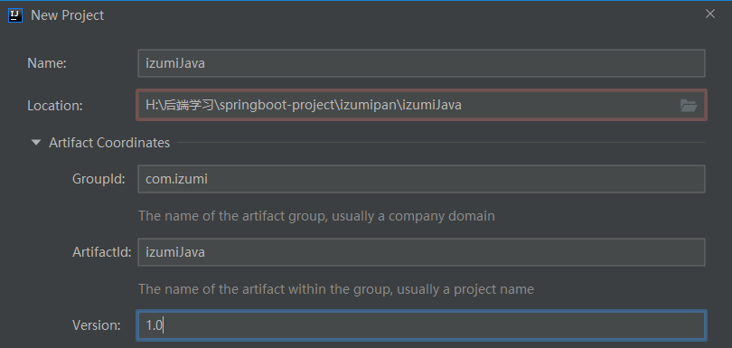
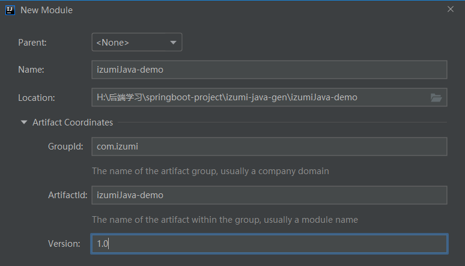

# <center> 代码生成器
## 一、项目构建
### 1.1 创建代码生成器项目

### 1.2 创建演示demo项目

#### 1. 导入依赖
```xml
<?xml version="1.0" encoding="UTF-8"?>
<project xmlns="http://maven.apache.org/POM/4.0.0"
         xmlns:xsi="http://www.w3.org/2001/XMLSchema-instance"
         xsi:schemaLocation="http://maven.apache.org/POM/4.0.0 http://maven.apache.org/xsd/maven-4.0.0.xsd">
    <modelVersion>4.0.0</modelVersion>

    <groupId>com.izumi</groupId>
    <artifactId>izumiJava</artifactId>
    <version>1.0</version>

    <properties>
        <maven.compiler.source>8</maven.compiler.source>
        <maven.compiler.target>8</maven.compiler.target>
        <mysql.version>8.0.17</mysql.version>
        <apache.commons.version>3.4</apache.commons.version>
        <logback.version>1.2.10</logback.version>
        <slf4j.version>1.7.7</slf4j.version>
    </properties>
    <dependencies>
        <dependency>
            <groupId>mysql</groupId>
            <artifactId>mysql-connector-java</artifactId>
            <version>${mysql.version}</version>
        </dependency>
        <!--apache的工具类-->
        <dependency>
            <groupId>org.apache.commons</groupId>
            <artifactId>commons-lang3</artifactId>
            <version>${apache.commons.version}</version>
        </dependency>

        <dependency>
            <groupId>ch.qos.logback</groupId>
            <artifactId>logback-classic</artifactId>
            <version>${logback.version}</version>
        </dependency>
        <dependency>
            <groupId>ch.qos.logback</groupId>
            <artifactId>logback-core</artifactId>
            <version>${logback.version}</version>
        </dependency>
        <dependency>
            <groupId>org.slf4j</groupId>
            <artifactId>slf4j-api</artifactId>
            <version>${slf4j.version}</version>
        </dependency>
    </dependencies>
</project>
```
#### 1. 导入依赖
```xml
<?xml version="1.0" encoding="UTF-8"?>
<project xmlns="http://maven.apache.org/POM/4.0.0"
         xmlns:xsi="http://www.w3.org/2001/XMLSchema-instance"
         xsi:schemaLocation="http://maven.apache.org/POM/4.0.0 http://maven.apache.org/xsd/maven-4.0.0.xsd">
    <modelVersion>4.0.0</modelVersion>

    <groupId>com.izumi</groupId>
    <artifactId>izumiJava-demo</artifactId>
    <version>1.0</version>
    <parent>
        <artifactId>spring-boot-starter-parent</artifactId>
        <groupId>org.springframework.boot</groupId>
        <version>2.2.6.RELEASE</version>
    </parent>
    <properties>
        <maven.compiler.source>8</maven.compiler.source>
        <maven.compiler.target>8</maven.compiler.target>
        <springboot.version>2.2.6.RELEASE</springboot.version>
        <mybatis.version>1.3.2</mybatis.version>
        <mysql.version>8.0.17</mysql.version>
    </properties>
    <dependencies>
        <dependency>
            <groupId>org.springframework.boot</groupId>
            <artifactId>spring-boot-starter-web</artifactId>
            <version>${springboot.version}</version>
        </dependency>
        <dependency>
            <groupId>org.mybatis.spring.boot</groupId>
            <artifactId>mybatis-spring-boot-starter</artifactId>
            <version>${mybatis.version}</version>
        </dependency>
        <dependency>
            <groupId>mysql</groupId>
            <artifactId>mysql-connector-java</artifactId>
            <version>${mysql.version}</version>
        </dependency>
    </dependencies>
</project>
```
#### 2. 创建配置文件
```properties
server.port=8070
spring.datasource.driver-class-name=com.mysql.cj.jdbc.Driver
spring.datasource.url=jdbc:mysql://127.0.0.1:3306/izumipan?serverTimezone=GMT%2B8&useUnicode=true&characterEncoding=utf8&autoReconnect=true&allowMultiQueries=true
spring.datasource.username=root
spring.datasource.password=root
spring.datasource.hikari.pool-name=izumijavaPoool
spring.datasource.hikari.minimum-idle=5
spring.datasource.hikari.idle-timeout=180000
spring.datasource.hikari.maximum-pool-size=10
spring.datasource.hikari.auto-commit=true
spring.datasource.hikari.max-lifetime=1800000
spring.datasource.hikari.connection-timeout=30000
spring.datasource.hikari.connection-test-query=SELECT 1

```
#### 3. 创建启动类
```java
package com.izumi;

import org.springframework.boot.SpringApplication;
import org.springframework.boot.autoconfigure.SpringBootApplication;

@SpringBootApplication
public class RunDemoApplication {
    public static void main(String[] args) {
        SpringApplication.run(RunDemoApplication.class, args);
    }
}
```

### 1.3 查看数据库表信息的三个语句
```sql
show table status # 可查看表信息

show full FIELDS from user_info # 可查看每个字段的详细信息

show INDEX FROM user_info # 可查看主键和索引
```
## 二、读取表结构
### 1.1 读取表
#### 1. 创建配置文件
```properties
db.driver.name=com.mysql.cj.jdbc.Driver
db.url=jdbc:mysql://127.0.0.1:3306/izumipan?serverTimezone=GMT%2B8&useUnicode=true&characterEncoding=utf8&autoReconnect=true&allowMultiQueries=true
db.username=root
db.password=root
```
#### 2. 创建读取配置文件工具类
```java
package com.izumijava.utils;

import java.io.IOException;
import java.io.InputStream;
import java.util.Iterator;
import java.util.Map;
import java.util.Properties;
import java.util.concurrent.ConcurrentHashMap;

public class PropertiesUtils {
    private static Properties props = new Properties();
    private static Map<String, String> PROPER_MAP = new ConcurrentHashMap();

    static {
        InputStream is = null;
        try {
            is = PropertiesUtils.class.getClassLoader().getResourceAsStream("application.properties");
            props.load(is);
            Iterator<Object> iterator = props.keySet().iterator();
            while(iterator.hasNext()) {
                String key = (String) iterator.next();
                PROPER_MAP.put(key, props.getProperty(key));
            }
        } catch (Exception e) {

        } finally {
            if (is != null) {
                try {
                    is.close();
                } catch (IOException e) {
                    e.printStackTrace();
                }
            }
        }
    }

    public static String getString(String key) {
        return PROPER_MAP.get(key);
    }

    public static void main(String[] args) {
        System.out.println(getString("db.driver.name"));
    }
}
```
#### 3. 创建连接数据库类，并进行读表操作
```java
package com.izumijava.builder;

import com.izumijava.utils.PropertiesUtils;
import org.slf4j.Logger;
import org.slf4j.LoggerFactory;

import java.sql.*;
import java.util.Properties;

/**
 * 读table
 */
public class BuildTable {
    private static final Logger logger = LoggerFactory.getLogger(BuildTable.class);
    private static Connection conn = null;

    private static String SQL_SHOW_TABLE_STATUS = "show table status";

    static {
        String driverName = PropertiesUtils.getString("db.driver.name");
        String url = PropertiesUtils.getString("db.url");
        String user = PropertiesUtils.getString("db.username");
        String password = PropertiesUtils.getString("db.password");
        try {
            Class.forName(driverName);
            logger.error("驱动加载成功");
            conn = DriverManager.getConnection(url, user, password);
        } catch (Exception e) {
            logger.error("数据库连接失败", e);
        }
    }
    public static void getTables() {
        PreparedStatement ps = null;
        ResultSet tableResult = null;
        try {
            ps = conn.prepareStatement(SQL_SHOW_TABLE_STATUS);
            tableResult = ps.executeQuery();
            while(tableResult.next()) {
                String tableName = tableResult.getString("name");
                String comment = tableResult.getString("comment");
                logger.info("tableName:{}, comment: {}", tableName, comment);
            }
        }catch (Exception e) {
            logger.error("读取表失败");
        } finally {
            if(tableResult != null) {
                try {
                    tableResult.close();
                } catch (SQLException throwables) {
                    throwables.printStackTrace();
                }
            }
            if(ps != null) {
                try {
                    ps.close();
                } catch (SQLException throwables) {
                    throwables.printStackTrace();
                }
            }
            if(conn != null) {
                try {
                    conn.close();
                } catch (SQLException throwables) {
                    throwables.printStackTrace();
                }
            }
        }
    }
}
```

### 1.2 读取表基本信息
#### 1. 配置文件增加如下代码
```properties
#是否忽略表前缀
ignore.table.prefix=true

#参数bean后缀
suffix.bean.param=Query
```

#### 2. 另外创建类读取配置信息
```java
package com.izumijava.bean;

import com.izumijava.utils.PropertiesUtils;

public class Constants {
    public static Boolean IGNORE_TABLE_PREFIX;
    public static String SUFFIX_BEAN_PARAM;
    static {
        IGNORE_TABLE_PREFIX = Boolean.valueOf(PropertiesUtils.getString("ignore.table.prefix"));
        SUFFIX_BEAN_PARAM = PropertiesUtils.getString("suffix.bean.param");
    }
}
```
#### 3. 创建表字段属性实体类
```java
package com.izumijava.bean;

public class FieldInfo {
    /**
     * 字段名
     */
    private String FieldName;
    /**
     * bean属性名称
     */
    private String propertyName;
    /**
     *
     */
    private String sqlType;
    /**
     * 字段类型
     */
    private String javaType;
    /**
     * 字段备注
     */
    private String comment;
    /**
     * 字段是否是自增长
     */
    private Boolean isAutoIncrement;

    public String getFieldName() {
        return FieldName;
    }

    public void setFieldName(String fieldName) {
        FieldName = fieldName;
    }

    public String getPropertyName() {
        return propertyName;
    }

    public void setPropertyName(String propertyName) {
        this.propertyName = propertyName;
    }

    public String getSqlType() {
        return sqlType;
    }

    public void setSqlType(String sqlType) {
        this.sqlType = sqlType;
    }

    public String getJavaType() {
        return javaType;
    }

    public void setJavaType(String javaType) {
        this.javaType = javaType;
    }

    public String getComment() {
        return comment;
    }

    public void setComment(String comment) {
        this.comment = comment;
    }

    public Boolean getAutoIncrement() {
        return isAutoIncrement;
    }

    public void setAutoIncrement(Boolean autoIncrement) {
        isAutoIncrement = autoIncrement;
    }
}
```
#### 4. 创建表信息实体类
```java
package com.izumijava.bean;

public class TableInfo {
    /**
     * 表名
     */
    private String tableName;
    /**
     * bean名称
     */
    private String beanName;
    /**
     * 参数名称
     */
    private String beanParamName;
    /**
     * 表注释
     */
    private String comment;
    /**
     * 字段信息
     */
    private List<FieldInfo> fieldList;
    /**
     * 唯一索引集合
     */
    private Map<String, List<FieldInfo>> keyIndexMap = new LinkedHashMap<>();
    /**
     * 是否有date类型
     */
    private Boolean haveDate;
    /**
     * 是否有时间类型
     */
    private Boolean haveDateTime;
    /**
     * 是否有bigdecimal类型
     */
    private Boolean haveBigDecimal;

    public String getTableName() {
        return tableName;
    }

    public void setTableName(String tableName) {
        this.tableName = tableName;
    }

    public String getBeanName() {
        return beanName;
    }

    public void setBeanName(String beanName) {
        this.beanName = beanName;
    }

    public String getBeanParamName() {
        return beanParamName;
    }

    public void setBeanParamName(String beanParamName) {
        this.beanParamName = beanParamName;
    }

    public String getComment() {
        return comment;
    }

    public void setComment(String comment) {
        this.comment = comment;
    }

    public List<FieldInfo> getFieldList() {
        return fieldList;
    }

    public void setFieldList(List<FieldInfo> fieldList) {
        this.fieldList = fieldList;
    }

    public Map<String, List<FieldInfo>> getKeyIndexMap() {
        return keyIndexMap;
    }

    public void setKeyIndexMap(Map<String, List<FieldInfo>> keyIndexMap) {
        this.keyIndexMap = keyIndexMap;
    }

    public Boolean getHaveDate() {
        return haveDate;
    }

    public void setHaveDate(Boolean haveDate) {
        this.haveDate = haveDate;
    }

    public Boolean getHaveDateTime() {
        return haveDateTime;
    }

    public void setHaveDateTime(Boolean haveDateTime) {
        this.haveDateTime = haveDateTime;
    }

    public Boolean getHaveBigDecimal() {
        return haveBigDecimal;
    }

    public void setHaveBigDecimal(Boolean haveBigDecimal) {
        this.haveBigDecimal = haveBigDecimal;
    }
}
```
#### 5. 首字母转大写/小写工具类
```java
package com.izumijava.utils;

public class StringUtils {
    public static String upperCaseFirstLetter(String field) {
        if(org.apache.commons.lang3.StringUtils.isEmpty(field)) {
            return field;
        }
        return field.substring(0, 1).toUpperCase() + field.substring(1);
    }

    public static String lowerCaseFirstLetter(String field) {
        if(org.apache.commons.lang3.StringUtils.isEmpty(field)) {
            return field;
        }
        return field.substring(0, 1).toLowerCase() + field.substring(1);
    }

    public static void main(String[] args) {
        System.out.println(lowerCaseFirstLetter("Company"));
    }
}
```

#### 6. 收集表信息（代码偏长，被注释了的代码则表示不是重点）
```java
com.izumijava.builder.BuildTable

/**
 * 获取表信息
 */
public static List<TableInfo> getTables() {
    PreparedStatement ps = null;
    ResultSet tableResult = null;

    List<TableInfo> tableInfoList = new ArrayList<>();
    try {
        ps = conn.prepareStatement(SQL_SHOW_TABLE_STATUS);
        tableResult = ps.executeQuery();
        while (tableResult.next()) {
            String tableName = tableResult.getString("name");
            String comment = tableResult.getString("comment");
            // logger.info("tableName:{}, comment: {}", tableName, comment);
            String beanName = tableName;
            if (Constants.IGNORE_TABLE_PREFIX) {
                beanName = tableName.substring(beanName.indexOf("_") + 1);
            }
            beanName = processFiled(beanName, true);
            // 用来收集表信息
            TableInfo tableInfo = new TableInfo();
            tableInfo.setTableName(tableName);
            tableInfo.setBeanName(beanName);
            tableInfo.setComment(comment);
            // 添加了后缀
            tableInfo.setBeanParamName(beanName + Constants.SUFFIX_BEAN_PARAM);
            readFieldInfo(tableInfo);
            getKeyIndexInfo(tableInfo);
            // logger.info("tableInfo: {}", JsonUtils.convertObj2Json(tableInfo));
            tableInfoList.add(tableInfo);
        }
    } catch (Exception e) {
        logger.error("读取表失败");
    } finally {
        if (tableResult != null) {
            try {
                tableResult.close();
            } catch (SQLException throwables) {
                throwables.printStackTrace();
            }
        }
        if (ps != null) {
            try {
                ps.close();
            } catch (SQLException throwables) {
                throwables.printStackTrace();
            }
        }
        if (conn != null) {
            try {
                conn.close();
            } catch (SQLException throwables) {
                throwables.printStackTrace();
            }
        }
    }
    return tableInfoList;
}

/**
 * _分割、判断第一个单词是否需要首字母转大写，其余单词都转大写
 *
 * @param field
 * @param upperCaseFirstLetter
 * @return
 */
private static String processFiled(String field, Boolean upperCaseFirstLetter) {
    StringBuffer sb = new StringBuffer();
    String[] fields = field.split("_");
    sb.append(upperCaseFirstLetter ? StringUtils.upperCaseFirstLetter(fields[0]) : fields[0]);
    for (int i = 1, len = fields.length; i < len; i++) {
        sb.append(StringUtils.upperCaseFirstLetter(fields[i]));
    }
    return sb.toString();
}
```


### 1.3 读取表字段
1. 类型转换数据
```java
com.izumijava.bean.Constants;

  public final static String[] SQL_DATE_TIME_TYPES = new String[]{"datetime", "timestamp"};
  public final static String[] SQL_DATE_TYPES = new String[]{"date"};
  public final static String[] SQL_DECIMAL_TYPE = new String[]{"decimal", "double", "float"};
  public final static String[] SQL_STRING_TYPE = new String[]{"char", "varchar", "text", "mediumtext", "longtext"};
  public final static String[] SQL_INTEGER_TYPE = new String[]{"int", "tinyint"};
  public final static String[] SQL_LONG_TYPE = new String[]{"bigint"};
```
2. sql数据类型转java数据类型方法实现
```java
com.izumijava.builder.BuildTable

/**
 * sql数据类型转java数据类型
 * @param type
 * @return
 */
private static String processJavaType(String type) {
    if (ArrayUtils.contains(Constants.SQL_INTEGER_TYPE, type)) {
        return "Integer";
    } else if (ArrayUtils.contains(Constants.SQL_LONG_TYPE, type)) {
        return "Long";
    } else if (ArrayUtils.contains(Constants.SQL_STRING_TYPE, type)) {
        return "String";
    } else if (ArrayUtils.contains(Constants.SQL_DATE_TIME_TYPES, type) || ArrayUtils.contains(Constants.SQL_DATE_TYPES, type)) {
        return "Date";
    } else if (ArrayUtils.contains(Constants.SQL_DECIMAL_TYPE, type)) {
        return "BigDecimal";
    } else {
        throw new RuntimeException("无法识别的类型：" + type);
    }
}
```
3. 读表字段方法实现
```java
com.izumijava.builder.BuildTable

/**
 * 读表字段
 *
 * @param tableInfo
 * @return
 */
private static void readFieldInfo(TableInfo tableInfo) {
    PreparedStatement ps = null;
    ResultSet fieldResult = null;

    List<FieldInfo> fieldInfoList = new ArrayList<>();
    try {
        ps = conn.prepareStatement(String.format(SQL_SHOW_TABLE_FIELDS, tableInfo.getTableName()));
        fieldResult = ps.executeQuery();

        Boolean haveDateTime = false;
        Boolean haveDate = false;
        Boolean haveBigDecimal = false;
        while (fieldResult.next()) {
            String field = fieldResult.getString("field");
            String type = fieldResult.getString("type");
            String extra = fieldResult.getString("extra");
            String comment = fieldResult.getString("comment");
            if (type.indexOf("(") > 0) {
                // 取括号中间的内容
                type = type.substring(0, type.indexOf("("));
            }
            String propertyName = processFiled(field, false);
            FieldInfo fieldInfo = new FieldInfo();
            fieldInfoList.add(fieldInfo);
            fieldInfo.setFieldName(field);
            fieldInfo.setComment(comment);
            fieldInfo.setSqlType(type);
            fieldInfo.setAutoIncrement("auto_increment".equalsIgnoreCase(extra) ? true : false);
            fieldInfo.setPropertyName(propertyName);
            fieldInfo.setJavaType(processJavaType(type));

            if (ArrayUtils.contains(Constants.SQL_DATE_TIME_TYPES, type)) {
                haveDateTime = true;
            }
            if(ArrayUtils.contains(Constants.SQL_DATE_TYPES, type)) {
                haveDate = true;
            }
            if (ArrayUtils.contains(Constants.SQL_DECIMAL_TYPE, type)) {
                haveBigDecimal = true;
            }
        }
        tableInfo.setHaveBigDecimal(haveBigDecimal);
        tableInfo.setHaveDate(haveDate);
        tableInfo.setHaveDateTime(haveDateTime);
        tableInfo.setFieldList(fieldInfoList);
    } catch (Exception e) {
        logger.error("读取表失败");
    } finally {
        if (fieldResult != null) {
            try {
                fieldResult.close();
            } catch (SQLException throwables) {
                throwables.printStackTrace();
            }
        }
        if (ps != null) {
            try {
                ps.close();
            } catch (SQLException throwables) {
                throwables.printStackTrace();
            }
        }
    }
}
```

### 1.3 读取表唯一索引
#### 1. 引入fastjson，方便打印数据
1. 引入包
```xml
<dependency>
    <groupId>com.alibaba</groupId>
    <artifactId>fastjson</artifactId>
    <version>1.1.42</version>
</dependency>
```
2. 添加工具类
```java
package com.izumijava.utils;

import com.alibaba.fastjson.JSON;
import com.alibaba.fastjson.serializer.SerializerFeature;

public class JsonUtils {
    public static String convertObj2Json(Object obj) {
        if(null == obj) {
            return null;
        }
        return JSON.toJSONString(obj, SerializerFeature.DisableCircularReferenceDetect);
    }
}
```
#### 2. 获取表索引
```java
com.izumijava.builder.BuildTable

/**
 * 获取表索引
 *
 * @param tableInfo
 * @return
 */
private static void getKeyIndexInfo(TableInfo tableInfo) {
    PreparedStatement ps = null;
    ResultSet fieldResult = null;

    try {
        Map<String, FieldInfo> tempMap = new HashMap();
        for (FieldInfo fieldInfo : tableInfo.getFieldList()) {
            tempMap.put(fieldInfo.getFieldName(), fieldInfo);
        }
        ps = conn.prepareStatement(String.format(SQL_SHOW_TABLE_INDEX, tableInfo.getTableName()));
        fieldResult = ps.executeQuery();
        while (fieldResult.next()) {
            String keyName = fieldResult.getString("key_name");
            Integer nonUnique = fieldResult.getInt("non_unique");
            String columnName = fieldResult.getString("column_name");
            if (nonUnique == 1) {
                continue;
            }
            List<FieldInfo> keyFieldList = tableInfo.getKeyIndexMap().get(keyName);
            if (null == keyFieldList) {
                keyFieldList = new ArrayList();
                tableInfo.getKeyIndexMap().put(keyName, keyFieldList);
            }
            keyFieldList.add(tempMap.get(columnName));
        }
    } catch (Exception e) {
        logger.error("读取索引失败");
    } finally {
        if (fieldResult != null) {
            try {
                fieldResult.close();
            } catch (SQLException throwables) {
                throwables.printStackTrace();
            }
        }
        if (ps != null) {
            try {
                ps.close();
            } catch (SQLException throwables) {
                throwables.printStackTrace();
            }
        }
    }
}
```


